***基于ROS（机器人操作系统）的数据展示系统***

*tips*:请在使用该系统前安装好相应的库文件（详见附录二），并在不同控制台分别运行roscore（ros操作系统内核）、rosbag play --loop --pause all.bag（ros数据包展示）和rosrun gmapping slam_gmapping（任务四建图处理进程）

该系统程序名为final_system，使用以下命令克隆git仓库：

```
git clone https://github.com/Asgard-Tim/ROS-Coding.git
```

安装好相关库文件后可通过以下命令运行系统程序：

```
//项目构建

cd /home/ubuntu/project/catkin_ws

catkin_make

//程序运行

source /home/ubuntu/project/catkin_ws/devel/setup.bash

cd /home/ubuntu/project/catkin_ws

rosrun final_system final_system
```

完整代码已上传至Github平台，URL地址：[Asgard-Tim/ROS-Coding: 重庆大学明月科创实验班软件设计课程作业 (github.com)](https://github.com/Asgard-Tim/ROS-Coding)

Bilibili同步上传系统演示视频Demo，链接：[重庆大学明月科创实验班软件设计作业--ROS数据展示系统_哔哩哔哩_bilibili](https://www.bilibili.com/video/BV1YV411M7jj/?vd_source=9360c83a7f1073e99c67f3821a48fb8c)

**程序主要结构与算法分析**

在**main()**函数中：

- 创建ROS节点和节点句柄。

- 调用**initialize()**函数显示初始菜单:提示用户选择登录、注册或退出系统。

- 定义一个**user**类，用于保存用户的用户名和密码信息;根据用户选择执行不同的操作：

- - 登录：要求用户输入用户名和密码，然后检查是否匹配存储在文件中的用户信息。
  - 注册：要求用户输入新的用户名和密码，然后将用户信息保存到文件中。
  - 退出系统：结束程序运行。

- 如果登录成功，调用**systeminitialize()**函数显示登录成功后的菜单:提示用户选择不同的数据可视化选项或退出系统。

- 根据用户选择执行不同的数据可视化操作：

**<u>任务一：用命令行窗口显示小车的IMU和里程计（odometry）数据</u>**

- - IMU数据：订阅IMU数据的ROS话题，将数据传递给回调函数**callback1**进行处理。

  - 回调函数**callback1**，处理IMU数据：

  - - 从接收到的IMU消息中获取线性加速度和角速度信息。
    - 使用**std::cout**打印出线性加速度和角速度信息。

  - 里程计数据：订阅里程计数据的ROS话题，将数据传递给回调函数**callback2**进行处理。

  - 回调函数**callback2**，处理里程计数据：

  - - 从接收到的里程计消息中获取位置和姿态信息。
    - 使用**std::cout**打印出位置和姿态信息。

**<u>任务二：用图形界面显示颜色相机和深度相机的数据（利用OpenCV库）</u>**

- - 颜色相机数据：订阅颜色相机数据的ROS话题，将数据传递给回调函数**callback3**进行处理。

  - 回调函数**callback3**，处理颜色相机数据：

  - - 将接收到的彩色图像消息转换为OpenCV的图像格式。
    - 使用OpenCV的窗口显示彩色图像。

  - 深度相机数据：订阅深度相机数据的ROS话题，将数据传递给回调函数**callback4**进行处理。

  - 回调函数**callback4**，处理深度相机数据：

  - - 将接收到的深度图像消息转换为OpenCV的图像格式。
    - 使用OpenCV的窗口显示深度图像。

**<u>任务三：用图形界面显示激光雷达的点云数据（利用PCL库）</u>**

- - 点云数据：订阅点云数据的ROS话题，将数据传递给回调函数**callback5**进行处理。

  - **pcl::visualization::CloudViewer viewer("Cloud      Viewer");**：创建一个PCL点云可视化器。

  - 回调函数**callback5**，处理点云数据：

  - - 将接收到的点云消息转换为PCL的点云格式。

- - - 使用PCL的可视化器显示点云。

**<u>任务四：自行选择一种高级算法（例如语义分割、三维重建、导航定位（SLAM）等），实现该算法（可以直接利用第三方库），将其集成到系统中</u>**

- - **选择Gmapping算法（一个基于2D激光雷达使用RBPF（Rao-Blackwellized Particle Filters）算法完成二维栅格地图构建的SLAM算法）**
  - 占据栅格地图数据：订阅占据栅格地图数据的ROS话题，将数据传递给回调函数**callback6**进行处理。
  - 回调函数**callback6**，处理占据栅格地图数据：
  - - - 从接收到的占据栅格地图消息中获取分辨率、宽度和高度等信息。
      - 创建一个OpenCV的图像对象，用于绘制地图。
      - 遍历地图的每个栅格，根据栅格的值绘制不同的颜色圆点。
      - 使用OpenCV的窗口显示地图。


**各功能部分构建过程与实现效果**

1.系统界面

（1）登录界面

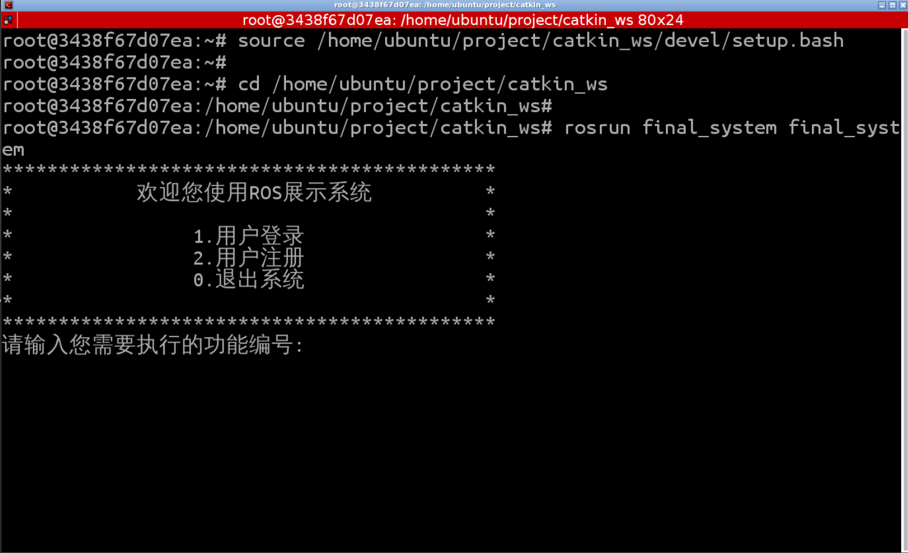

（2）功能选择界面

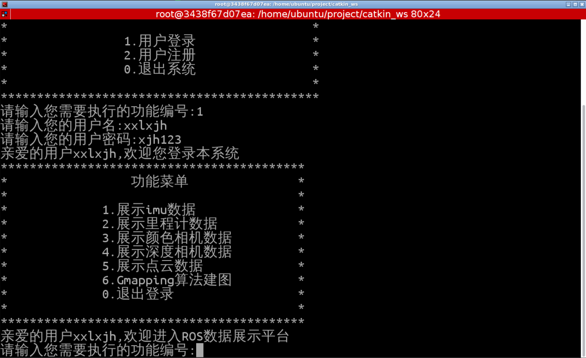

2.各部分功能

整体架构思路（以imu数据显示为例，其余任务基本一致）：

（1）在运行rosbag后利用rostopic list指令查看当前开放的所有话题

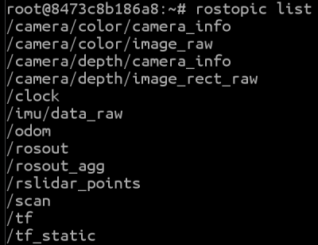

（2）找到所需数据所对应的话题（如imu数据对应的是/imu/data_raw这一topic)，利用rostopic info指令查看其消息类型(如图中Type所示)

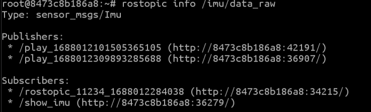

（3）根据获得的消息类型（如上图Type所示应为sensor_msg/Imu),利用rosmsg show指令查看其对应的各部分数据类型


（4）根据获得的数据类型，编写对应callback函数展示对应数据

```
void callback1(const sensor_msgs::Imu::ConstPtr& ptr)
{
    cout << "std_msgs/Header header" << endl;
    cout << "    uint32 seq: " << ptr->header.seq << endl;
    cout << "    time stamp: " << ptr->header.stamp << endl;
    cout << "    string frame_id: " << ptr->header.frame_id << endl;
    cout << "geometry_msgs/Quaternion orientation" << endl;
    cout << "    float64 x: " << ptr->orientation.x << endl;
    cout << "    float64 y: " << ptr->orientation.y << endl;
    cout << "    float64 z: " << ptr->orientation.z << endl;
    cout << "    float64 w: " << ptr->orientation.w << endl;
    cout << "float64[9] orientation_covariance" << endl;
    cout << "    ";
    for (int i = 0; i < 9; i++) {
        cout << ptr->orientation_covariance[i] << " ";
    }
    cout << endl;
    cout << "geometry_msgs/Vector3 angular_velocity" << endl;
    cout << "    float64 x: " << ptr->angular_velocity.x << endl;
    cout << "    float64 y: " << ptr->angular_velocity.y << endl;
    cout << "    float64 z: " << ptr->angular_velocity.z << endl;
    cout << "float64[9] angular_velocity_covariance" << endl;
    cout << "    ";
    for (int i = 0; i < 9; i++) {
        cout << ptr->angular_velocity_covariance[i] << " ";
    }
    cout << endl;
    cout << "geometry_msgs/Vector3 linear_acceleration" << endl;
    cout << "    float64 x: " << ptr->linear_acceleration.x << endl;
    cout << "    float64 y: " << ptr->linear_acceleration.y << endl;
    cout << "    float64 z: " << ptr->linear_acceleration.z << endl;
    cout << "float64[9] linear_acceleration_covariance" << endl;
    cout << "    ";
    for (int i = 0; i < 9; i++) {
        cout << ptr->linear_acceleration_covariance[i] << " ";
    }
    cout << endl;
    cout << "-------------------------------------------------------------" << endl;
    return ;
}
```

（5）编写主函数程序建立订阅者节点订阅话题内容，并调用对应callback函数进行数据处理与显示

```
ros::init(argc, argv, "imu");

ros::NodeHandle nodeHandle;

ros::Subscriber subscriber = nodeHandle.subscribe("/imu/data_raw", 1000, callback1);

ros::spin();
```

注意：在任务二、三中，对应的callback函数需要分别调用opencv和pcl库，将读取的数据进行处理，以可视化图形界面的形式显示出来。

这里以任务三为例展示如何使用库文件进行数据处理并进行图形化界面显示：

```
void callback5(const sensor_msgs::PointCloud2::ConstPtr& msg)
{
    pcl::PointCloud<pcl::PointXYZ> cloud;  
    // 创建一个存储PointXYZ类型点云数据的PointCloud对象，每个点有三个坐标值
    pcl::PCLPointCloud2 pcl_pc;  
    // 创建一个PCLPointCloud2对象，用于存储传感器消息中的点云数据
    pcl_conversions::toPCL(*msg, pcl_pc);  
    // 将ROS中的sensor_msgs::PointCloud2类型消息转换为PCL中的PCLPointCloud2类型
    pcl::fromPCLPointCloud2(pcl_pc, cloud); 
    // 将PCLPointCloud2类型转换为PointCloud<pcl::PointXYZ>类型
    viewer.showCloud(cloud.makeShared());  // 在可视化窗口中显示点云数据
}
```

最终各部分功能实现的效果图如下：

（1）展示imu数据

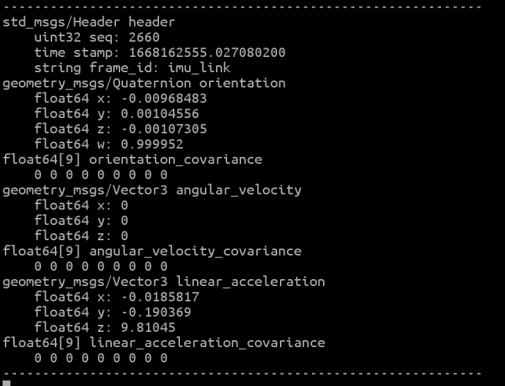

（2）展示里程计数据

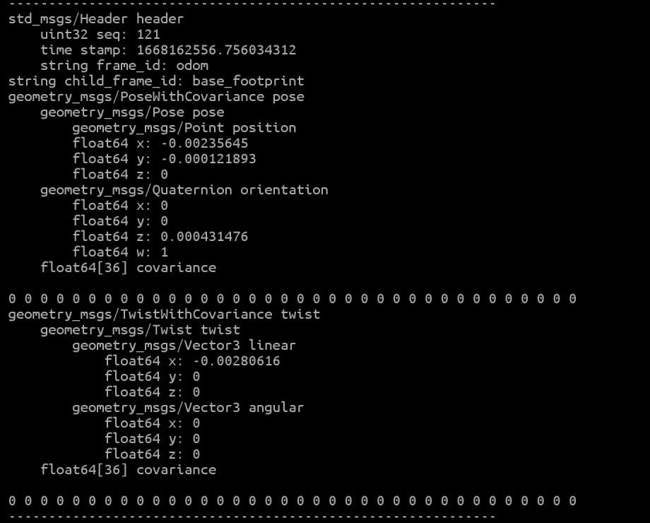

（3）展示颜色相机数据

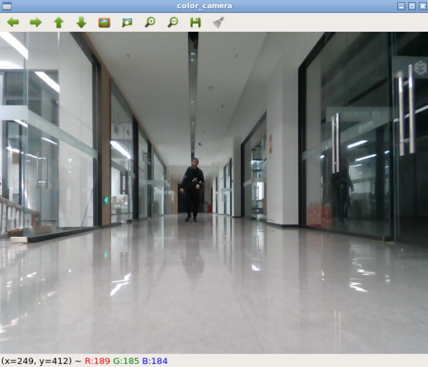

（4）展示深度相机数据

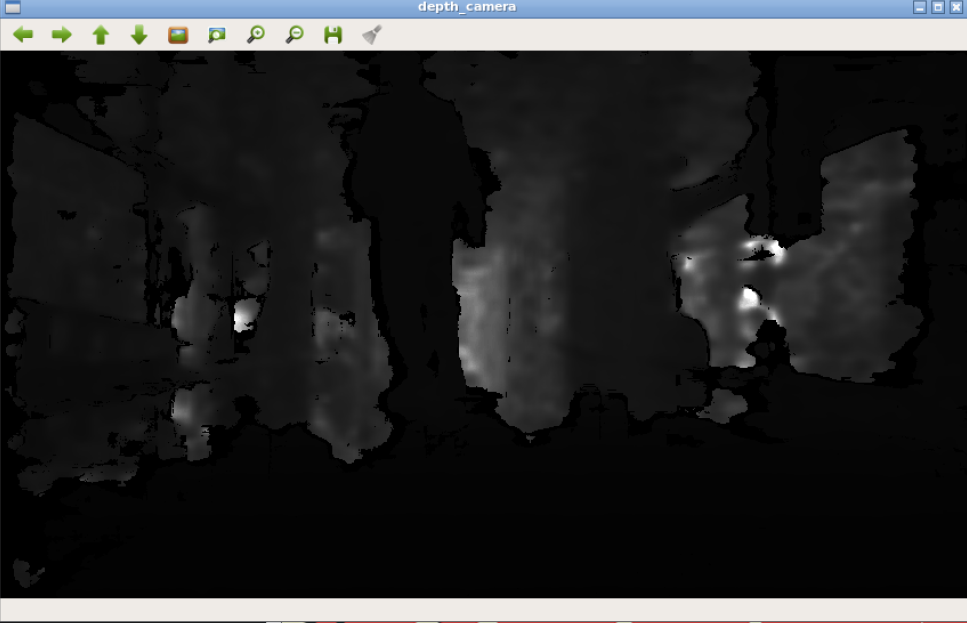

（5）展示激光雷达点云数据

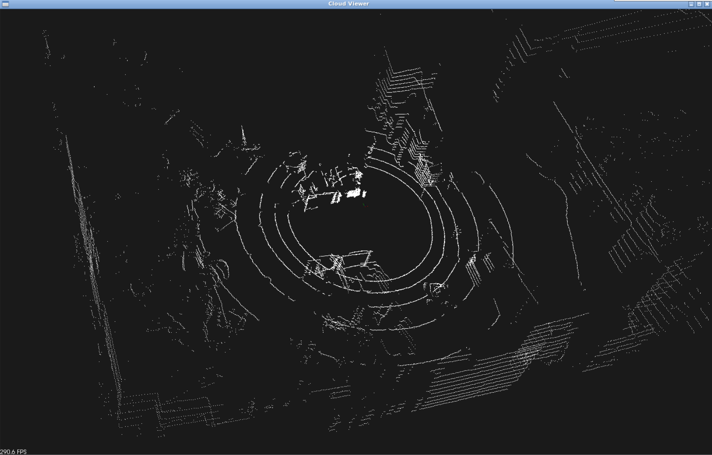

3.Gmapping建图算法的实现

（1）msg数据类型查询

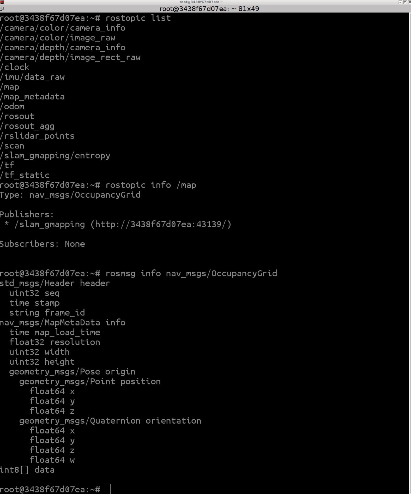

（2）启动Gmapping算法功能包

输入如下命令：

```
rosrun gmapping slam_gmapping
```

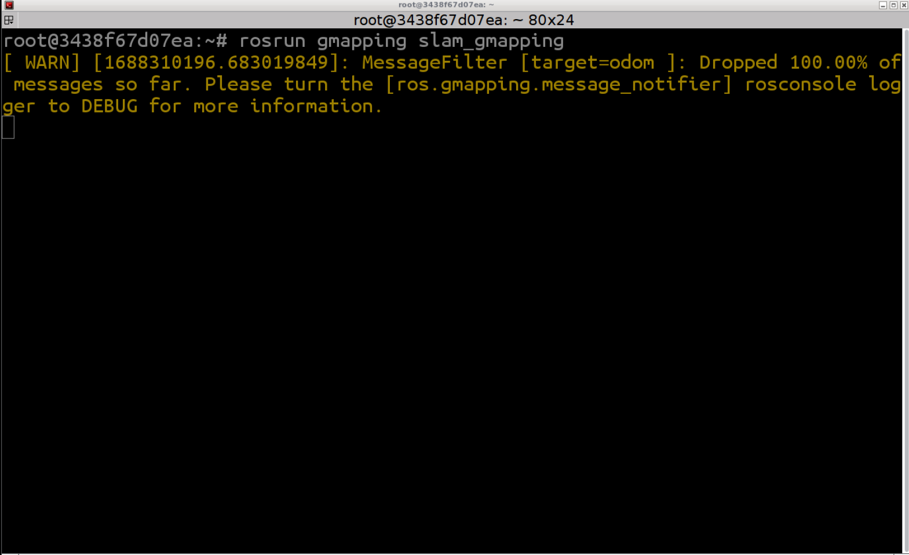

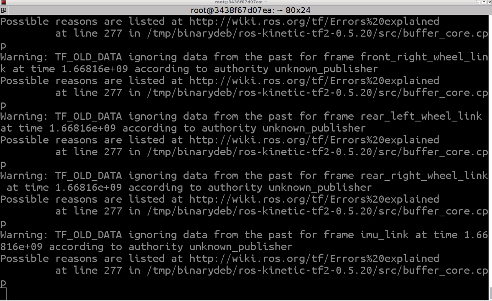

（3）编写回调函数，利用opencv库绘制2D地图

```
void callback6(const nav_msgs::OccupancyGrid::ConstPtr& ptr)

{  

  std::cout << "resolution: " << ptr->info.resolution << std::endl;

  std::cout << "width: " << ptr->info.width << std::endl;

  std::cout << "height: " << ptr->info.height << std::endl;

  double scale = 1.0;

  int width = 1200;

  int height = 1200;

  cv::Point offset(-1600, -1600);

  cv::Mat map = cv::Mat::zeros(cv::Size(width, height), CV_8UC3);

  for (int i = 0; i < ptr->info.width * ptr->info.height; ++i) {

  int x = (i % ptr->info.width + offset.x) * scale, y = (i / ptr->info.width + offset.y) * scale;

  if (ptr->data[i] == -1) {

  cv::circle(map, cv::Point(x, y), 1, cv::Scalar(255, 255, 255), -1);

    } else if (ptr->data[i] >= 80) {

  cv::circle(map, cv::Point(x, y), 3, cv::Scalar(0, 0, 0), -1);

    } else {

  cv::circle(map, cv::Point(x, y), 3, cv::Scalar(0, 255, 0), -1);

    }   

  }

  cv::imshow("map", map);

  cv::waitKey(1000);

  return ;

}
```

（4）建立节点并订阅/map话题，调用回调函数

```
ros::init(argc, argv, "show_map");
ros::NodeHandle nodeHandle;
ros::Subscriber subscriber = nodeHandle.subscribe("/map", 1000, callback6);
ros::spin();
```

（5）建图结果

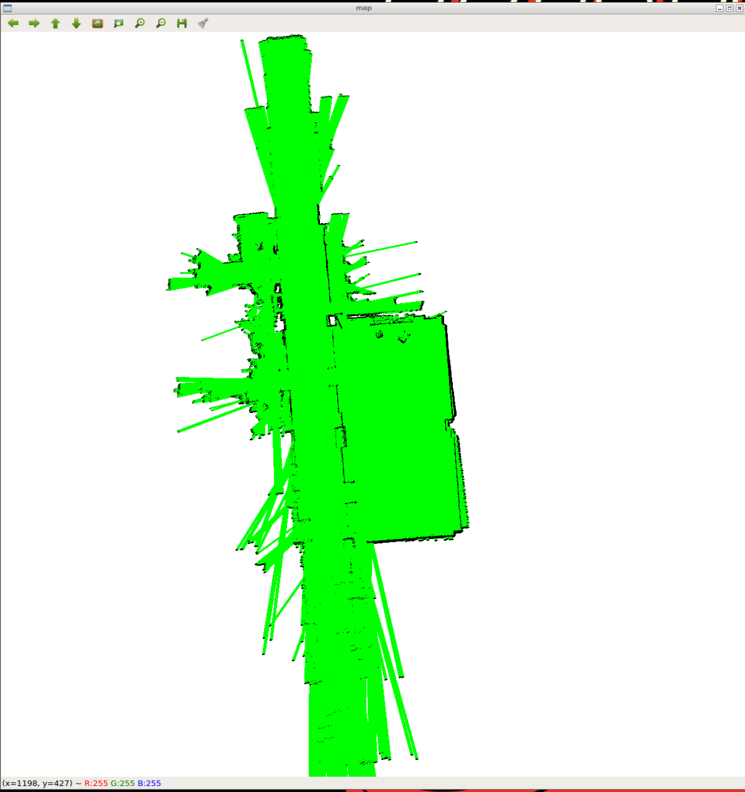


附录一：必要的库文件和头文件：

1. - **<iostream>**：用于输入输出操作。
   - **<fstream>**：用于文件读写操作。
   - **<string>**：用于处理字符串。
   - **<ctime>**：用于时间相关操作。
   - **<iomanip>**：用于格式化输出。
   - **"ros/ros.h"**：ROS的主要头文件。
   - **"sensor_msgs/Imu.h"**：ROS中IMU（惯性测量单元）数据的消息类型。
   - **"nav_msgs/Odometry.h"**：ROS中里程计数据的消息类型。
   - **<cstring>**：用于C风格字符串操作。
   - **<opencv2/opencv.hpp>**：OpenCV库的头文件。
   - **"cv_bridge/cv_bridge.h"**：ROS中用于将ROS图像消息转换为OpenCV图像格式的库。
   - **"image_transport/image_transport.h"**：ROS中用于图像传输的库。
   - **<memory>**：用于内存管理。
   - **"pcl/visualization/cloud_viewer.h"**：PCL（点云库）中用于可视化点云的类。
   - **"pcl_conversions/pcl_conversions.h"**：PCL与ROS消息类型转换的库。
   - **"pcl/point_types.h"**：定义了PCL中常用的点类型。
   - **"pcl/PCLPointCloud2.h"**：PCL中点云数据的消息类型。
   - **"pcl/conversions.h"**：PCL与ROS消息类型转换的库。
   - **"pcl_ros/transforms.h"**：PCL中点云坐标系变换的库。
   - **"nav_msgs/OccupancyGrid.h"**：ROS中占据栅格地图数据的消息类型。

附录二：安装各库文件的命令

1. ```
   sudo apt-get update
   ```

2. 更新包管理器的软件包列表。

3. ```
   sudo apt-get upgrade
   ```

4. 升级系统中的所有已安装软件包。

5. ```
   sudo apt-get install libopencv-dev
   ```

6. 安装OpenCV库的开发文件。

7. ```
   sudo apt-get install libopencv-contrib-dev
   ```

8. 安装OpenCV贡献模块的开发文件。

9. ```
   sudo apt-get update
   ```

10. 再次更新包管理器的软件包列表。

11. ```
    sudo apt-get install libproj-dev
    ```

12. 安装Proj库的开发文件，Proj库提供了地理投影转换的功能。

13. ```
    sudo apt-get install libpcl-dev
    ```

14. 安装PCL（Point Cloud Library）库的开发文件，PCL库用于点云数据处理和分析。

15. ```
    sudo apt-get install libsdl1.2-dev
    ```

16. 安装SDL 1.2库的开发文件，SDL库用于创建图形用户界面和处理多媒体。

17. ```
    sudo apt install libsdl-image1.2-dev
    ```

18. 安装SDL_image 1.2库的开发文件，SDL_image库提供了图像处理功能。

19. ```
    sudo apt-get install ros-kinetic-gmapping
    ```

20. 安装ROS Kinetic版本中的gmapping软件包，gmapping是用于构建占据栅格地图的SLAM算法。

21. ```
    sudo apt-get install ros-kinetic-slam-gmapping
    ```

22. 安装ROS Kinetic版本中的slam_gmapping软件包，slam_gmapping提供了用于构建占据栅格地图的SLAM算法。